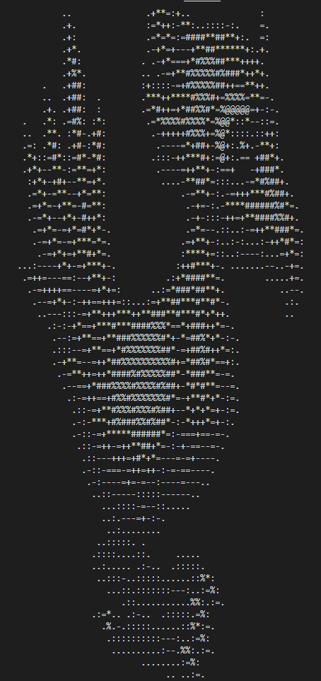
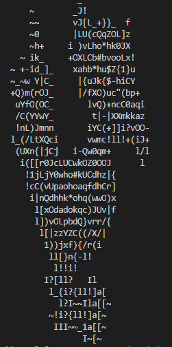
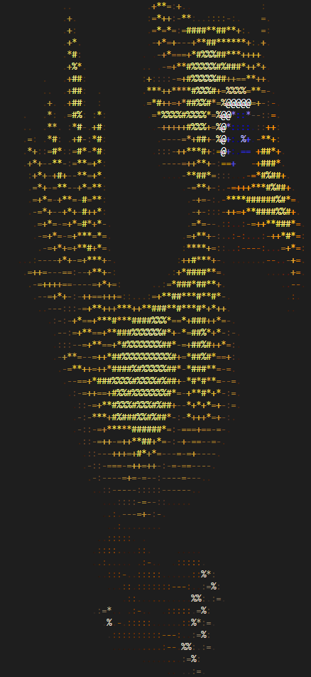

# Asciify
A rust library for converting images to a readable format on the command line

You can import the library straight from this git repo by adding 

```
asciify = { git = "https://github.com/hkattelu/Asciify", branch = "master" }
```

to your `Cargo.toml`.

To use the code, simply construct a builder and set the properties desired.
You can then choose to print the text straight to the console, or convert
it to a string for later use:

```rust
// Printing to console with color
AsciiBuilder::new(opt.input)
    .set_deep(false);
    .set_invert(false);
    .to_std_out(true);
```



```rust
// Generating a string and resizing
AsciiBuilder::new(opt.input)
    .set_deep(true);
    .set_resize(Some(32, 32));
    .build();
```




```shell
$ ./asciify ./test-images/SPECIAL(ChocoboA)900.png -c
```

